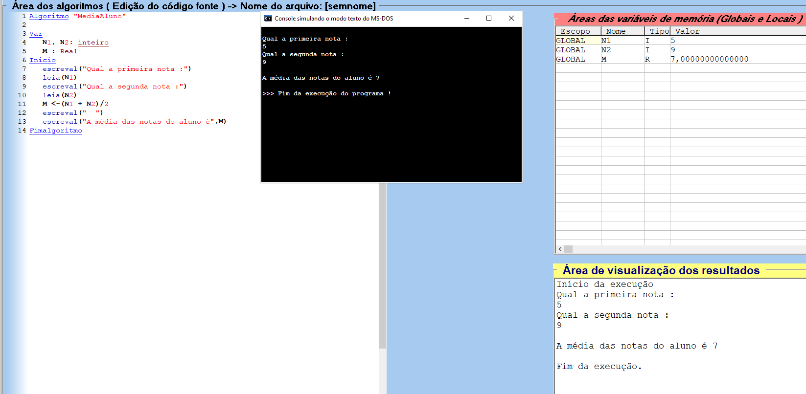
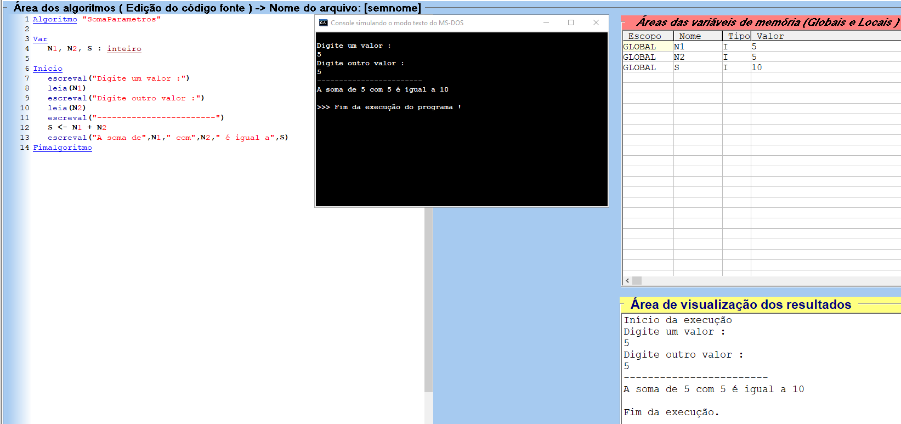

# Aula [03] - [Comando de Entrada e Operadores]

## 📘 Parte Teórica
Nesta etapa, o Guanabara explicou como tirar o algoritmo do "automático" e permitir que o usuário insira dados, além de como processar cálculos matemáticos.

### 📥 Comando de Entrada e Interatividade
- **Interatividade:** O programa agora consegue "ouvir" o usuário através do teclado.
- **O Comando `leia`:** Ele pausa a execução do algoritmo e aguarda que um valor seja digitado e armazenado em uma variável pré-definida.
- **Entrada vs Saída:** A combinação de `escreva` (pergunta) e `leia` (resposta) cria a interface do programa.

---

## 🔢 Operadores Aritméticos e Ordem de Precedência

Para realizar cálculos, o computador segue uma hierarquia matemática rigorosa.

### 🧮 Tabela de Operadores:
| Operador | Função | Exemplo |
| :---: | :--- | :--- |
| `+` | Adição | `A + B` |
| `-` | Subtração | `A - B` |
| `*` | Multiplicação | `A * B` |
| `/` | Divisão (Real) | `A / B` (Ex: 5 / 2 = 2.5) |
| `\` | Divisão (Inteira) | `A \ B` (Ex: 5 \ 2 = 2) |
| `^` | Exponenciação | `A ^ B` (A elevado a B) |
| `%` ou `MOD` | Resto da Divisão | `5 % 2` (Resultado: 1) |

### 🏗️ Ordem de Precedência (Quem vem primeiro?)
> ```text
> Ordem de Execução
>      ├── 1º Parenteses ( )
>      ├── 2º Potenciação e Raiz ^
>      ├── 3º Mult. e Div. * , /
>      └── 4º Soma e Subt. + , -
> ```

---

## 💻 Parte Prática (Mão na Massa)
Aplicação dos conceitos de entrada de dados e cálculos básicos no VisualG.

### 🛠️ Comandos Aprendidos
- `leia(variavel)`: Captura o que o usuário digita e guarda na variável.
- **Atribuição com Cálculo:** `S <- A + B` (Soma os valores e guarda o resultado em S).
- **Média Aritmética:** Uso de parênteses para garantir que a soma ocorra antes da divisão: `M <- (N1 + N2) / 2`.

### 📂 Arquivos desta pasta:
- `Aula_03.md`: Notas desta aula.
- `SomaParametros.alg`: Exercício de soma com interação.
- `MediaAluno.alg`: Exercício prático de cálculo de média.
-`resultado_Aula03` : Print da prática realizada.




## 🚀 Insight e Atalhos
- **Dica de Ouro:** Sempre use `escreva` antes do `leia` para o usuário saber o que ele deve digitar. Um programa sem instruções é um programa confuso!
- **Status:** Aula finalizada e cálculos dominados! ✅

---
[Voltar para o início do repositório](../README.md)