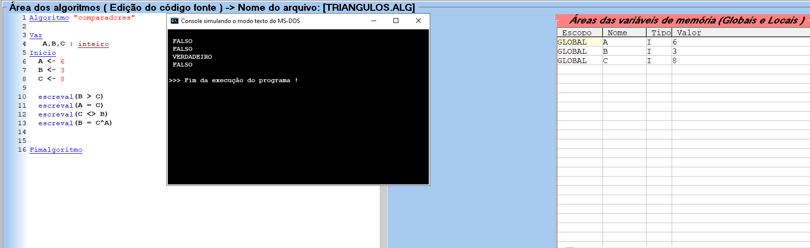
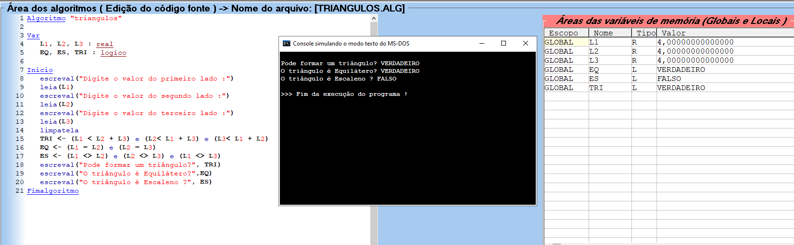

# Aula [04] - [Operadores Lógicos e Relacionais]

## 📘 Parte Teórica
Nesta etapa, o Guanabara explicou os pilares que permitem ao algoritmo realizar comparações e tomar decisões baseadas em condições verdadeiras ou falsas.

### ⚖️ Operadores Relacionais (Comparações)
São usados para comparar dois valores. O resultado será sempre um valor **Lógico** (Verdadeiro ou Falso).
- `>`  : Maior que
- `<`  : Menor que
- `>=` : Maior ou igual a
- `<=` : Menor ou igual a
- `=`  : Igual a
- `<>` : Diferente de

---

## 🧠 Operadores Lógicos

Eles servem para combinar múltiplas condições na mesma expressão.

### 🧩 Os três pilares:
1. **E (AND):** Só resulta em VERDADEIRO se **todas** as condições forem verdadeiras.
2. **OU (OR):** Resulta em VERDADEIRO se **pelo menos uma** condição for verdadeira.
3. **NÃO (NOT):** Inversor. O que é verdadeiro vira falso e vice-versa.

### 🏗️ Ordem de Precedência Geral (Atualizada)
> ```text
> Hierarquia de Execução
>     ├── 1º Aritméticos (Parenteses, Potência, Mult/Div, Soma/Sub)
>     ├── 2º Relacionais ( > , < , = , etc.)
>     └── 3º Lógicos
>           ├── 1º NÃO
>           ├── 2º E
>           └── 3º OU
> ```

---


## 💻 Parte Prática (Mão na Massa)
Aqui é onde o bicho pega no VisualG ao testar expressões complexas.

### 🛠️ Comandos Aprendidos
- **Uso de Variáveis Lógicas:** Declaração de variáveis do tipo `logico`.
- **Expressões Compostas:** Exemplo: `(A = B) e (C > D)`.
- **Testes de Triângulos:** Prática clássica para verificar se três lados formam um triângulo (Equilátero, Isósceles ou Escaleno).


### 📂 Arquivos desta pasta:
- `Aula_04.md`: Notas desta aula.
- `Comparadores.alg`: Testes de operadores relacionais.
- `Triangulos.alg`: Exercício prático de lógica geométrica.




## 🚀 Insight e Atalhos
- **Dica de Ouro:** O operador de igualdade no VisualG para comparações é apenas `=`, diferente de outras linguagens (como JS) que usam `==`. Não confunda a **Atribuição** (`<-`) com a **Comparação** (`=`).
- **Status:** Aula finalizada e lógica afiada! ✅
---
[Voltar para o início do repositório](../README.md)