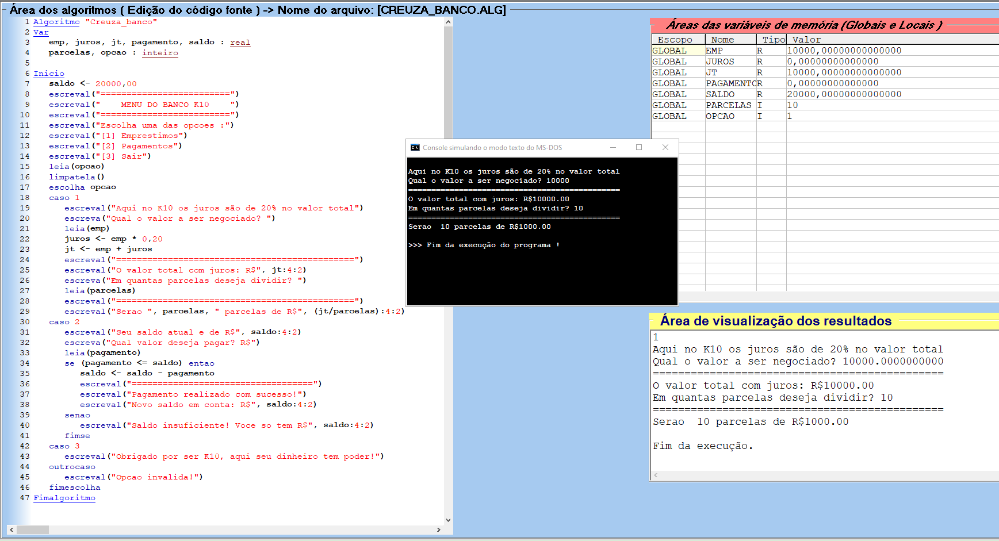

# Aula [06] - [Resolução de Exercícios]

## 📘 Parte Teórica
Nesta etapa, resolvemos os desafios práticos da "Creuza", focando em cálculos de conversão, impostos e lógica financeira básica.

### 📝 Exercícios:
1. **Creuza Dólar:** Conversão de moeda com base na cotação.
2. **Creuza Temperatura:** Conversão de Fahrenheit para Celsius.
3. **Creuza Impostos:** Cálculo de taxas sobre produtos importados.
4. **Creuza Empréstimo (Banco):** Cálculo de parcelas com juros.
5. **Creuza Idade:** Cálculo de anos com base no nascimento.

---

## 💻 Parte Prática (Mão na Massa)

### 🌟 Destaque Especial: CREUZA_BANCO 🏦
Neste exercício, decidi ir além do proposto pelo Guanabara. Enquanto a aula focava apenas no cálculo linear, implementei uma **Interface de Menu Dinâmica**:
- Utilizei a estrutura `escolha` para criar um seletor de opções.
- Organizei visualmente o menu para simular um sistema bancário real.
- Antecipei conceitos de **Estruturas de Controle** que seriam vistos apenas em aulas futuras para entregar uma experiência de usuário (UX) superior.

### 🛠️ Comandos Aprendidos
- `leia()` / `escreva()`: Entrada e saída de dados.
- `escolha` / `caso`: Seleção múltipla para criação de menus (Self-learning).
- `Se` / `Senao` : Estrutura condicional aplicada para dar dinâmica aos exercícios e validar as escolhas da Creuza.
- **Operadores Aritméticos:** Cálculos de porcentagem e divisão de parcelas.

---

### 📂 Arquivos desta pasta:

## Pasta Exercícios:
- `CREUZA_BANCO.ALG` (⭐ Featured)
- `CREUZA_DOLLAR.ALG`
- `CREUZA_IMPOSTOS.ALG`
- `CREUZA_TEMPERATURA.ALG`
- `CREUZA_ANO.ALG`

## Pasta Imagens:
- `Ceruza_Banco.PNG`
- `Ceruza_dolar.PNG`
- `Ceruza_imposto.PNG`
- `Ceruza_temperatura.PNG`
- `Ceruza_ano.PNG`

---

## 🚀 Insight e Atalhos
- **Dica de Ouro:** A lógica de menus com `escolha` economiza várias linhas de `se...entao` encadeados, deixando o código muito mais limpo e profissional.
- **Status:** Aula finalizada com upgrade de lógica! ✅

---
[⬅️ Voltar para o início](../README.md)